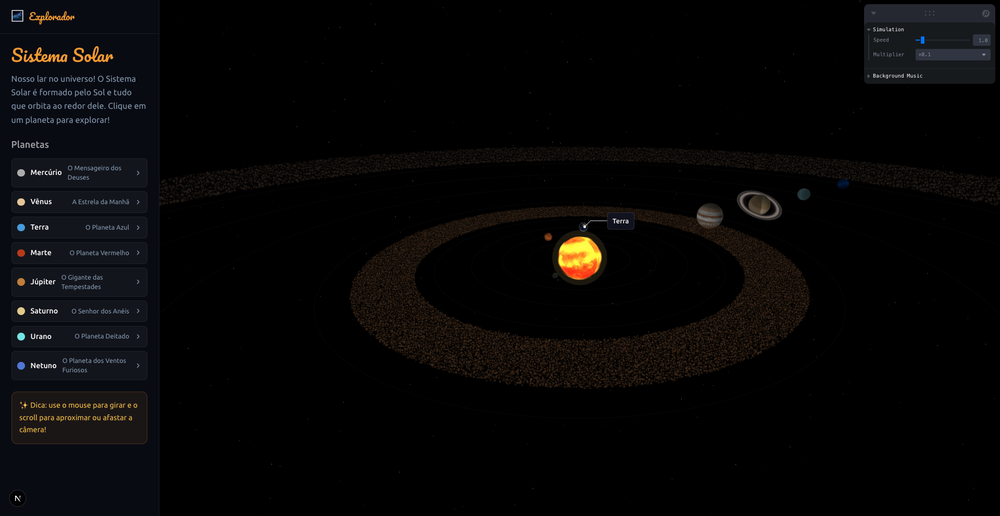

# 🪐 Sistema Solar Interativo



> Um projeto feito de pai para filho — para ajudá-lo a entender onde vivemos neste cosmos tão grande.

Este projeto nasceu de uma vontade simples: mostrar ao meu filho o lugar que habitamos no universo. Mais do que um exercício técnico, é uma janela para o espaço que podemos explorar juntos — girando planetas, descobrindo luas, e sentindo a imensidão que existe além do nosso céu.

## ✨ O que você encontra aqui

- Todos os **8 planetas do Sistema Solar** com texturas reais e órbitas animadas
- **Luas** dos planetas, visíveis ao selecionar cada planeta
- **Cinturão de asteroides** entre Marte e Júpiter
- **Câmera interativa** — arraste, zoom e explore livremente
- Informações sobre cada planeta ao clicar nele
- Renderização 3D em tempo real com WebGL

## 🛠️ Tecnologias

| Tecnologia | Uso |
|---|---|
| [Next.js 16](https://nextjs.org/) | Framework React com App Router |
| [React Three Fiber](https://r3f.docs.pmnd.rs/) | Renderização 3D com React |
| [Three.js](https://threejs.org/) | Motor de renderização WebGL |
| [Drei](https://github.com/pmndrs/drei) | Helpers para R3F |
| [Zustand](https://zustand-demo.pmnd.rs/) | Gerenciamento de estado |
| [Tailwind CSS v4](https://tailwindcss.com/) | Estilização |
| TypeScript | Tipagem estática |

## 🚀 Como rodar

### Pré-requisitos

- [Node.js](https://nodejs.org/) versão 18 ou superior
- npm (já vem com o Node)

### Instalação

```bash
# Clone o repositório
git clone <url-do-repositorio>
cd solar-system

# Instale as dependências
npm install
```

### Iniciando o servidor de desenvolvimento

```bash
npm run dev
```

Abra [http://localhost:3000](http://localhost:3000) no navegador.

### Outros comandos

```bash
# Build de produção
npm run build

# Rodar em modo produção (após o build)
npm start

# Verificar erros de lint
npm run lint
```

## 🗂️ Estrutura do projeto

```
solar-system/
├── app/
│   └── page.tsx              # Página principal (Server Component)
├── components/
│   └── canvas/
│       ├── Scene.tsx          # Canvas 3D principal
│       ├── SceneClient.tsx    # Wrapper client-side (necessário para WebGL)
│       ├── Planet.tsx         # Componente de planeta
│       ├── Moon.tsx           # Componente de lua
│       ├── Sun.tsx            # Sol com luz pontual
│       ├── Rings.tsx          # Anéis (Saturno e Urano)
│       ├── OrbitLine.tsx      # Linhas de órbita
│       ├── AsteroidBelt.tsx   # Cinturão de asteroides
│       └── CameraController.tsx # Controles de câmera
├── lib/
│   ├── data/
│   │   ├── planets.ts         # Dados dos planetas
│   │   ├── moons.ts           # Dados das luas
│   │   └── sun.ts             # Dados do sol
│   └── store/
│       └── useSolarStore.ts   # Estado global (Zustand)
└── public/
    └── textures/              # Texturas dos planetas (.jpg)
```

## 🖼️ Texturas

As texturas são da [Solar System Scope](https://www.solarsystemscope.com/textures/) (arquivos `2k_*`). Se quiser qualidade maior, baixe as versões originais e coloque em `public/textures/` com os nomes:

```
sun.jpg, mercury.jpg, venus.jpg, earth.jpg, mars.jpg,
jupiter.jpg, saturn.jpg, saturn_ring.png, uranus.jpg, neptune.jpg,
moon.jpg
```

## 🌌 Para o meu filho

O cosmos é imenso — mas também é nosso. Cada estrela que você vê à noite é um sol distante. E nós, aqui na Terra, somos parte disso tudo. Espero que esse projeto te ajude a sentir essa grandeza, e que desperte em você a mesma curiosidade que me move.

*Com amor, Papai.*

---

Feito com Next.js, React Three Fiber e muita curiosidade.
